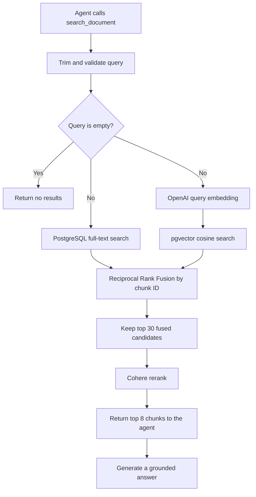

# simple-rag

A RAG built with LangChain ecosystem. Node.JS + React.JS

## RAG setup step

### 1. Load test docs

- [https://docs.langchain.com]()
- See `backend/scripts/download-test-docs.ts`

### 2. Setup Database/Vector Store

I'm using Postgres DB here because it provides CRUD, full text search (tsvector) and similarity search capability

- Prisma ORM for easy CRUD control, while
- raw query for similarity/vector search (prisma still does not support them natively)
- Important pieces
  - vector similarity search:
  ```
  CREATE TABLE document_chunks (
    ...
    "embedding" vector(1536) NOT NULL,
    ...
  );
  ```
  - tsvector column for full text search:
  ```
  ALTER TABLE "document_chunks"
  ADD COLUMN "search_vector" tsvector
  GENERATED ALWAYS AS (to_tsvector('english', "content")) STORED;
  ```

### 3. Chunking & Embedding

- Chunk size: 1000
- Overlap: 200
- Embedding model: OpenAI Embeddings `text-embedding-3-small`
- See `backend/scripts/ingest/ingest-docs.ts` for implementation

### 4. Retrieval

Retrieval is exposed to the LangChain agent as the `search_document` tool. It uses a hybrid pipeline so that exact keyword matches from PostgreSQL full-text search and semantic matches from pgvector can complement each other.



1. **Normalize and isolate the query**
   - `retrieve()` trims the query and returns an empty list when no text remains.
   - Every database search is filtered by `APP_ENVIRONMENT`, preventing documents from different environments from being mixed.

2. **Retrieve lexical and semantic candidates in parallel**
   - **Full-text search** converts the query with PostgreSQL `websearch_to_tsquery('english', ...)`, matches it against the generated `search_vector` column, and ranks results with `ts_rank_cd`. The GIN index on `search_vector` supports this path.
   - **Semantic search** embeds the query with OpenAI `text-embedding-3-small` into a 1,536-dimensional vector. pgvector orders chunks by cosine distance with `<=>`; the returned similarity score is `1 - cosine distance`. An HNSW cosine index supports this path.
   - Each path returns at most 50 candidates. They execute concurrently with `Promise.all()`.

3. **Fuse both ranked lists with Reciprocal Rank Fusion (RRF)**
   - Candidates are deduplicated by `chunkId`.
   - Each candidate receives `RRF score = Σ 1 / (60 + rank)` across the lists in which it appears.
   - RRF uses result positions instead of combining the raw full-text and cosine scores, whose scales are not directly comparable. Chunks ranked highly by both searches receive contributions from both lists.

4. **Rerank the strongest candidates**
   - The top 30 fused candidates are sent to Cohere `rerank-v4.0-pro` with the original query.
   - Cohere performs a final query-to-content relevance pass and returns at most 8 chunks.

5. **Return grounded context to the agent**
   - Each result contains the chunk content and source metadata (`chunkId`, `documentId`, `source`, `title`, and `chunkIndex`), along with its retrieval score, RRF score/ranks, and Cohere rerank score.
   - The agent receives these results through `search_document` and is prompted to answer only from the retrieved sources and cite the supplied source identifiers.

The limits and model names are centralized in `backend/src/services/retrieval/utils/config.ts`. The pipeline is orchestrated by `backend/src/services/retrieval/retrieve.ts`, with each retrieval stage implemented in the neighboring files under `backend/src/services/retrieval`.

### 5. UI

Frontend is built with `React` and `Vite` for build tool.
The UI is using Vecel AI SDK -- AI Elements. Check [AI SDK AI Elements](https://elements.ai-sdk.dev)
Nothing too fancy, I just want to make things as simple as possible

## Run with Docker Compose

### One-time environment setup

Create the backend environment file and fill in the required API keys:

```sh
cp backend/.env.example backend/.env
```

Both modes run Prisma migrations before Fastify starts. Inside the Compose network, the backend connects to PostgreSQL through the `postgres` hostname.

### Development mode

Use development mode while editing the application:

```sh
docker compose -f compose.yaml -f compose.dev.yaml up --build
```

Development mode bind-mounts `frontend/` and `backend/` into their containers:

- Saving frontend code triggers Vite hot-module replacement or a browser reload.
- Saving backend code recompiles TypeScript and restarts Fastify.
- Vite proxies `/api` requests to the `backend` Compose service.

If a `package.json` or the lockfile changes, rebuild the images and refresh the anonymous dependency volumes:

```sh
docker compose -f compose.yaml -f compose.dev.yaml up --build --renew-anon-volumes
```

View development logs:

```sh
docker compose -f compose.yaml -f compose.dev.yaml logs -f backend frontend
```

Stop development mode:

```sh
docker compose -f compose.yaml -f compose.dev.yaml down
```

### Production mode

Production mode builds the frontend with Vite, serves it through Nginx, and runs the compiled Fastify backend:

```sh
docker compose up --build
```

Nginx serves the frontend and proxies `/api` requests to the `backend` Compose service.

View production logs:

```sh
docker compose logs -f backend frontend
```

Stop production mode:

```sh
docker compose down
```

### Service URLs

The URLs are the same in both modes:

- Frontend: <http://localhost:5173>
- Backend: <http://localhost:3000>
- Adminer: <http://localhost:8080>
- PostgreSQL: `localhost:5432`
